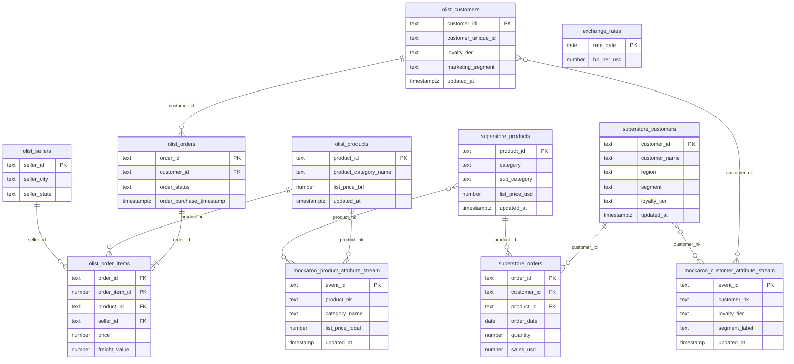
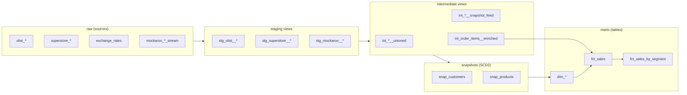
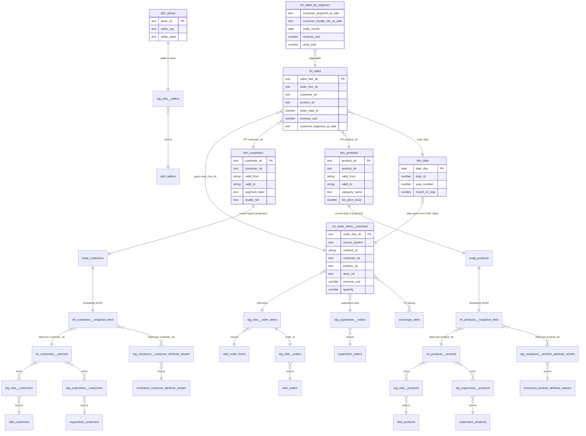
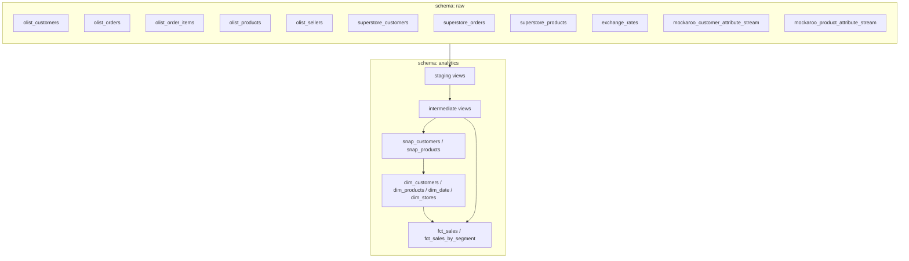

# Database diagrams

Postgres database **`deltacart`** with two logical areas:

| Schema | Owner | Purpose |
|--------|--------|---------|
| **`raw`** | Docker init (`postgres/init/*.sql`) | Simulated OLTP landing zone (Olist BR + Superstore US + Mockaroo streams) |
| **`analytics`** | dbt (`POSTGRES_SCHEMA`, default `analytics`) | Staging views, intermediate models, SCD2 snapshots, star-schema marts |

> **Note:** `analytics` objects are built by dbt. Relationships below are **logical** (SQL `ref` / join keys), not enforced `FOREIGN KEY` constraints.

---

## Schema: `raw`

OLTP-style tables. Relationship lines are Postgres foreign keys except Mockaroo streams (logical `customer_nk` / `product_nk` links, no DB constraint).



### `raw` table inventory

| Table | PK | References |
|-------|-----|------------|
| `olist_customers` | `customer_id` | — |
| `olist_sellers` | `seller_id` | — |
| `olist_products` | `product_id` | — |
| `olist_orders` | `order_id` | `olist_customers(customer_id)` |
| `olist_order_items` | `(order_id, order_item_id)` | `olist_orders`, `olist_products`, `olist_sellers` |
| `superstore_customers` | `customer_id` | — |
| `superstore_products` | `product_id` | — |
| `superstore_orders` | `order_id` | `superstore_customers`, `superstore_products` |
| `exchange_rates` | `rate_date` | — |
| `mockaroo_customer_attribute_stream` | `event_id` | append-only; `customer_nk` aligns with dbt unified keys |
| `mockaroo_product_attribute_stream` | `event_id` | append-only; `product_nk` aligns with dbt unified keys |

### Table descriptions (`raw`)

#### Olist (Brazil) — core OLTP

**`olist_customers`**  
What: Master list of buyers in the Brazil division, modeled after Olist-style e-commerce (zip, city, state, loyalty tier, marketing segment).  
Why: Represents the **pre-acquisition** source system. Attributes like `marketing_segment` and `loyalty_tier` change over time (`updated_at`) and feed SCD Type 2 in the warehouse so you can ask “what segment was this customer in **when they bought**?”

**`olist_sellers`**  
What: Marketplace sellers (third-party merchants) who fulfill Olist order lines.  
Why: Olist facts are at **order-line** grain and require a seller per line. Exposed as `dim_stores` in analytics (Olist-only; Superstore has no equivalent in this demo).

**`olist_products`**  
What: Product catalog for the Brazil channel (category, name length, list price in BRL).  
Why: Catalog attributes are **slowly changing** (`list_price_brl`, category, `updated_at`). The warehouse tracks product history separately from order lines.

**`olist_orders`**  
What: Order headers: which customer placed the order, status, purchase time, estimated delivery.  
Why: Normalized OLTP shape—headers link to **line items** in `olist_order_items`. Purchase timestamp drives point-in-time dimension joins in `fct_sales`.

**`olist_order_items`**  
What: One row per product line on an Olist order (price, freight, product, seller). Composite PK `(order_id, order_item_id)`.  
Why: This is the **transactional grain** for Brazil revenue. Staging + `int_order_items__enriched` roll price + freight into line revenue and convert BRL → USD.

#### Superstore (US) — acquired division

**`superstore_customers`**  
What: Customers in the US division after acquisition (name, region, segment, state, loyalty).  
Why: Same business concept as Olist customers but a **different schema and IDs**. Staging prefixes keys (`superstore:…`) so unions do not collide with Brazil.

**`superstore_products`**  
What: US product catalog (category, sub-category, list price in USD).  
Why: Mirrors `olist_products` for the second source system. USD list prices avoid FX on the catalog side; order revenue is already in USD on `superstore_orders`.

**`superstore_orders`**  
What: Simplified “one product per order” Superstore-style rows (quantity, sales, discount, ship mode).  
Why: Contrasts with Olist’s header/line model. Demonstrates **heterogeneous source shapes** unified into one fact grain (`order_line_nk`) in the warehouse.

#### Reference & change streams

**`exchange_rates`**  
What: Daily BRL-per-USD reference rates (sparse seed dates in init SQL).  
Why: Olist line amounts are in BRL; `int_order_items__enriched` picks the latest rate on or before `ordered_at` (with a dbt var fallback) so **cross-system revenue is comparable in USD**.

**`mockaroo_customer_attribute_stream`**  
What: Append-only landing table for synthetic customer attribute events (segment, loyalty, address, etc.), typically loaded from Mockaroo CSV between dbt runs.  
Why: Simulates **CDC / streaming updates** without a real Kafka stack. `int_customers__snapshot_feed` merges this with OLTP and picks the latest row per `customer_nk` so snapshots see attribute changes on the next `dbt snapshot` run.

**`mockaroo_product_attribute_stream`**  
What: Append-only product attribute events (category, list price, currency, etc.).  
Why: Same pattern as the customer stream—for **product SCD2** demos (e.g. price or category changes after orders were placed).

---

## Schema: `analytics`

All dbt models, snapshots, and marts materialize under **`analytics`** (see `profiles.yml` / `POSTGRES_SCHEMA`). Default materializations: **views** for staging/intermediate, **tables** for marts, **snapshot tables** for SCD2 history.

### High-level lineage



### Detailed relationships



### `analytics` object inventory

| Layer | Object | Reads from |
|-------|--------|------------|
| Staging | `stg_olist__customers` | `raw.olist_customers` |
| Staging | `stg_olist__orders` | `raw.olist_orders` |
| Staging | `stg_olist__order_items` | `raw.olist_order_items` |
| Staging | `stg_olist__products` | `raw.olist_products` |
| Staging | `stg_olist__sellers` | `raw.olist_sellers` |
| Staging | `stg_superstore__customers` | `raw.superstore_customers` |
| Staging | `stg_superstore__orders` | `raw.superstore_orders` |
| Staging | `stg_superstore__products` | `raw.superstore_products` |
| Staging | `stg_mockaroo__customer_attribute_stream` | `raw.mockaroo_customer_attribute_stream` |
| Staging | `stg_mockaroo__product_attribute_stream` | `raw.mockaroo_product_attribute_stream` |
| Intermediate | `int_customers__unioned` | `stg_olist__customers`, `stg_superstore__customers` |
| Intermediate | `int_products__unioned` | `stg_olist__products`, `stg_superstore__products` |
| Intermediate | `int_customers__snapshot_feed` | `int_customers__unioned`, Mockaroo staging |
| Intermediate | `int_products__snapshot_feed` | `int_products__unioned`, Mockaroo staging |
| Intermediate | `int_order_items__enriched` | Olist items+orders, Superstore orders, `raw.exchange_rates` |
| Snapshot | `snap_customers` | `int_customers__snapshot_feed` |
| Snapshot | `snap_products` | `int_products__snapshot_feed` |
| Mart | `dim_customers` | `snap_customers` |
| Mart | `dim_products` | `snap_products` |
| Mart | `dim_date` | `int_order_items__enriched` |
| Mart | `dim_stores` | `stg_olist__sellers` |
| Mart | `fct_sales` | `int_order_items__enriched` + PIT dims |
| Mart | `fct_sales_by_segment` | `fct_sales` |

### Table descriptions (`analytics`)

#### Staging — clean `raw`, one entity per model

Staging views are the **contract** between OLTP and the warehouse: rename columns, cast types, and add source-prefixed natural keys so Brazil and US IDs never clash.

| Object | What | Why |
|--------|------|-----|
| `stg_olist__customers` | Typed view of `raw.olist_customers` with prefixed `customer_nk` (e.g. `olist:oc1`). | Single place for Olist customer column names and the unified key used downstream. |
| `stg_olist__orders` | Typed view of `raw.olist_orders`. | Isolates order-header logic before joining to line items. |
| `stg_olist__order_items` | Typed view of `raw.olist_order_items`. | Keeps line-level facts separate from header joins in intermediate models. |
| `stg_olist__products` | Typed view of `raw.olist_products` with `product_nk`. | Prepares catalog attributes for union and snapshot feeds. |
| `stg_olist__sellers` | Typed view of `raw.olist_sellers` with `store_nk`. | Feeds `dim_stores`; only Olist has sellers in this project. |
| `stg_superstore__customers` | Typed view of `raw.superstore_customers` with prefixed `customer_nk` (e.g. `superstore:sc1`). | Same role as Olist staging for the US division. |
| `stg_superstore__orders` | Typed view of `raw.superstore_orders`. | Source for Superstore lines in `int_order_items__enriched` (no separate line table). |
| `stg_superstore__products` | Typed view of `raw.superstore_products` with `product_nk`. | Aligns Superstore catalog fields with Olist staging for union/snapshots. |
| `stg_mockaroo__customer_attribute_stream` | Typed view of the Mockaroo customer stream. | Normalizes stream column names before merging into `int_customers__snapshot_feed`. |
| `stg_mockaroo__product_attribute_stream` | Typed view of the Mockaroo product stream. | Same for product attributes and SCD2 demos. |

#### Intermediate — conformed grains and snapshot inputs

| Object | What | Why |
|--------|------|-----|
| `int_customers__unioned` | `UNION ALL` of Olist + Superstore customer staging. | One logical customer population across acquired systems before attribute resolution. |
| `int_products__unioned` | `UNION ALL` of Olist + Superstore product staging. | One product population for catalog history and facts. |
| `int_customers__snapshot_feed` | Latest row per `customer_nk` from unioned OLTP **and** Mockaroo stream (tie-break: mockaroo > olist > superstore). | **Input to `snap_customers`**: only the current “winning” attributes per key per run, so dbt snapshots record changes when `updated_at` moves forward. |
| `int_products__snapshot_feed` | Latest row per `product_nk` from unioned OLTP and Mockaroo. | **Input to `snap_products`** for product SCD2. |
| `int_order_items__enriched` | Unified **order-line** fact prep: Olist lines (joined to orders) + Superstore orders, `revenue_usd`, `quantity`, conformed `customer_nk` / `product_nk` / `store_nk`. | Single transactional grain for both sources; applies **FX** to Olist and is the driver for `fct_sales` and `dim_date`. |

#### Snapshots — SCD Type 2 history (dbt-managed tables)

| Object | What | Why |
|--------|------|-----|
| `snap_customers` | dbt snapshot on `int_customers__snapshot_feed` (timestamp strategy on `updated_at`, key `customer_nk`). Adds `dbt_valid_from` / `dbt_valid_to` / `dbt_scd_id`. | Persists **full history** of customer attributes (segment, loyalty, etc.) for point-in-time joins—not just “current” OLTP state. |
| `snap_products` | dbt snapshot on `int_products__snapshot_feed` (same pattern for products). | Persists catalog history (category, list price, currency) so facts can use **price/segment at time of sale**. |

#### Marts — star schema for analysis

| Object | What | Why |
|--------|------|-----|
| `dim_customers` | Dimension projection of `snap_customers`: `customer_sk`, attributes, `valid_from` / `valid_to`. | Analyst-facing customer dimension for joins; SK and validity columns support **PIT** logic in `fct_sales`. |
| `dim_products` | Dimension projection of `snap_products` with product attributes and validity range. | Same for products—category and list price **as they were** when the order happened. |
| `dim_date` | Calendar spine from min/max `ordered_at` in enriched order lines (year, quarter, month, `date_id`, etc.). | Standard conformed date dimension; avoids repeating date logic in every mart. |
| `dim_stores` | Seller/store attributes from Olist staging (`store_nk`, city, state). | Optional geography for marketplace fulfillment; not joined in `fct_sales` today but available for extensions. |
| `fct_sales` | Grain: one row per `order_line_nk`. Measures: `revenue_usd`, `quantity`. Degenerate dims + **PIT** `customer_sk`, `product_sk`, segment/tier/category **at sale**. | Core fact table for the interview story: revenue attributed to **segment and catalog state at purchase time**, not current OLTP. |
| `fct_sales_by_segment` | Monthly rollup of `fct_sales` by `customer_segment_at_sale`, loyalty tier, units and revenue. | Ready-made **marketing mart** for segment trends without re-aggregating the fact table. |

### Point-in-time join keys (`fct_sales`)

| Fact column | Dimension | Join condition |
|-------------|-----------|----------------|
| `customer_nk` | `dim_customers` | `customer_nk` match and `ordered_at ∈ [valid_from, valid_to)` |
| `product_nk` | `dim_products` | `product_nk` match and `ordered_at ∈ [valid_from, valid_to)` |
| `ordered_at` | `dim_date` | `ordered_at::date = date_day` → `order_date_id` |

Unified natural keys are prefixed in staging (`olist:…`, `superstore:…`) so Brazil and US entities do not collide.

---

## Cross-schema view



---

## Regenerating from a live database

With Docker Postgres up (`docker compose up -d`) and dbt built (`dbt run && dbt snapshot`):

```bash
PGPASSWORD=deltacart psql -h localhost -p 5433 -U deltacart -d deltacart -c "
SELECT tc.table_schema, tc.table_name, kcu.column_name,
       ccu.table_schema AS foreign_table_schema,
       ccu.table_name AS foreign_table_name,
       ccu.column_name AS foreign_column_name
FROM information_schema.table_constraints AS tc
JOIN information_schema.key_column_usage AS kcu
  ON tc.constraint_name = kcu.constraint_name
JOIN information_schema.constraint_column_usage AS ccu
  ON ccu.constraint_name = tc.constraint_name
WHERE tc.constraint_type = 'FOREIGN KEY'
  AND tc.table_schema IN ('raw', 'analytics')
ORDER BY 1, 2;
"
```

Only **`raw`** will return foreign-key rows; **`analytics`** relationships come from dbt lineage (this document).
